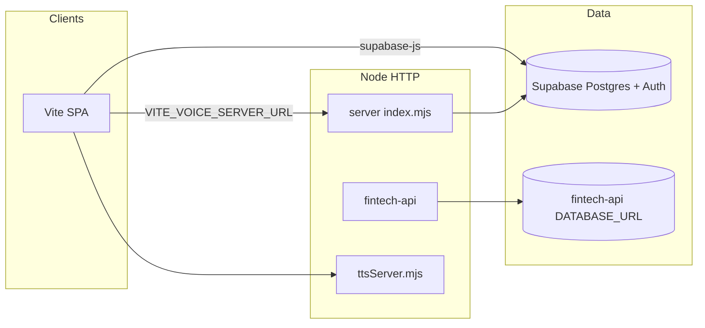

# Runtime architecture (`server/` vs `fintech-api/` vs SPA)

This document is the **single place** to answer: _which process owns which HTTP surface, and where money flows?_

## Big picture

| Runtime                      | Code                   | Typical port               | Primary data store                         | Typical consumer                                                                  |
| ---------------------------- | ---------------------- | -------------------------- | ------------------------------------------ | --------------------------------------------------------------------------------- |
| **Web app**                  | `src/` (Vite)          | 3000                       | Supabase (browser anon key)                | End users                                                                         |
| **Property / voice sidecar** | `server/index.mjs`     | 4000 (`VOICE_SERVER_PORT`) | Supabase (service role from env)           | SPA via `VITE_VOICE_SERVER_URL`, webhooks, cron, voice clients                    |
| **TTS**                      | `server/ttsServer.mjs` | 4010 (`TTS_SERVER_PORT`)   | None (ElevenLabs)                          | SPA / voice pipeline                                                              |
| **Ledger / wallet API**      | `fintech-api/`         | 4101 (`PORT`)              | Postgres `DATABASE_URL` (dedicated schema) | Mobile, partners, or future SPA routes — **not wired by default in the main SPA** |

## What the SPA calls today

- **Supabase** — Auth, RLS-backed tables, shortlet flows (e.g. `wallets` in Supabase), most CRUD.
- **`VITE_VOICE_SERVER_URL`** → **`server/`** — Voice STT, AI assistant, document OCR, rent/Flutterwave helpers, accounting-style routes, web push webhook mount, **RBAC** (`GET /api/rbac/me`, `GET /api/rbac/demo/accounting` — Supabase JWT + `config/rbac-permission-matrix.json`), etc.
- **`VITE_API_BASE_URL`** — Used by a few integrations (e.g. Nigerian market data). It is **not** automatically the same host as `fintech-api` unless you configure it that way.

If you add first-class ledger UI that talks to `fintech-api`, introduce an explicit env (e.g. `VITE_FINTECH_API_URL`) instead of overloading `VITE_API_BASE_URL`.

## Flutterwave: two stacks (do not confuse webhooks)

Both codepaths can talk to Flutterwave, but they use **different HTTP apps** and **different webhook paths**:

| Concern          | `server/` (`server/flutterwavePaymentService.mjs`, etc.) | `fintech-api/`                                                           |
| ---------------- | -------------------------------------------------------- | ------------------------------------------------------------------------ |
| Example init     | e.g. `POST /api/payments/rent/flutterwave`               | e.g. `POST /api/payments/flutterwave/...` (see `fintech-api/src/routes`) |
| Webhook URL path | e.g. **`POST /api/payments/webhook`**                    | **`POST /api/webhooks/flutterwave`**                                     |
| Persistence      | Supabase tables / rent payment model                     | Ledger + wallet schema via `pg`                                          |

**Rule:** In Flutterwave dashboard, point each app’s webhook to **one** backend only. Running both webhooks for the **same** charge without a documented split will duplicate or fight over settlement logic.

## Ownership guidelines (for new features)

1. **User-facing property + rent + voice + “use Supabase RLS”** → prefer extending **`server/`** + Supabase migrations.
2. **Double-entry ledger, escrow holds, programmatic withdrawals, partner JWT API** → prefer **`fintech-api/`** + its migrations/SQL under `fintech-api/sql/`.
3. **Never** copy-paste payment verification between the two; extract a **single** small module or call one service from the other if you must unify.

## Related entrypoints

- `server/index.mjs` — mounts all `server/*Service.mjs` routers.
- `server/httpSecurity.mjs` — shared helmet/CORS/rate limits for the sidecar.
- `fintech-api/server.js` — process entry; loads `DATABASE_URL`, `JWT_SECRET`, etc.
- `fintech-api/src/app.js` — Express app: `/api` + Flutterwave webhook signature middleware.

## Env hints

See root `.env.example` for Supabase and voice URLs. For `fintech-api`, see `fintech-api/.env.example` and `fintech-api/src/config/env.js` (`JWT_SECRET`, `DATABASE_URL`, `CORS_ORIGIN`, …).
