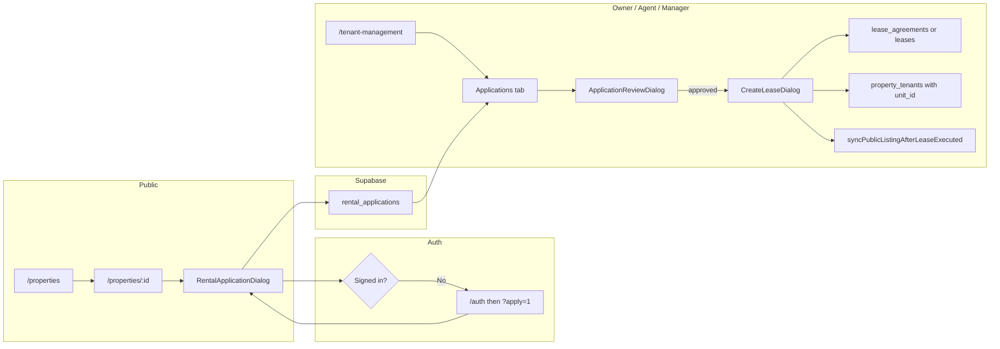

# Leasing workflow (end-to-end)

How a tenant moves from discovery to an executed lease in this codebase, including routes, main UI, and data writes.

## 1. Discovery (public)

| Step            | Route             | Page / component       |
| --------------- | ----------------- | ---------------------- |
| Browse listings | `/properties`     | `PublicProperties`     |
| Property detail | `/properties/:id` | `PublicPropertyDetail` |

**Apply** is driven from the detail page (`PropertyActionCard`). If the user is not signed in, they are sent to `/auth` with a return URL; after login, `?apply=1` can reopen the application dialog automatically.

**Alternate apply URL:** `/apply/:id` → `TenantApplication` (standalone apply page).

## 2. Tenant submits an application

| Item       | Location                                                                                                |
| ---------- | ------------------------------------------------------------------------------------------------------- |
| UI         | `RentalApplicationDialog`                                                                               |
| Create API | `createApplication` in `src/services/applications/applicationApi.ts`                                    |
| Gates      | `canSubmitRentalApplication` / `canApproveRentalApplication` in `src/services/property/leaseSummary.ts` |

**Multi-unit:** The form can require a **unit** (`unit_id`), loaded via `fetchPropertyUnitsLeaseStatus`. That value is stored on **`rental_applications.unit_id`**.

**Data:** New row in **`rental_applications`** (typically `pending`). Optional documents via `uploadApplicationDocuments`.

## 3. Owner / agent / manager reviews

| Item           | Location                                                                                                      |
| -------------- | ------------------------------------------------------------------------------------------------------------- |
| Hub            | `/tenant-management` → `TenantManagement`                                                                     |
| Allowed roles  | `NAV_TENANT_MGMT_ROLES`: admin, super_admin, owner, agent, manager (`src/App.routes.tsx`)                     |
| List           | **Applications** tab → `ApplicationsTab` (data from `fetchApplications` in `src/services/leases/leaseApi.ts`) |
| Review UI      | `ApplicationReviewDialog`                                                                                     |
| Status updates | `updateApplicationStatus` in `applicationApi.ts`                                                              |

Only applications with **`status === 'approved'`** are eligible for the lease-creation step below.

## 4. Lease creation (“execution”)

| Item           | Location                                                                                                                           |
| -------------- | ---------------------------------------------------------------------------------------------------------------------------------- |
| Entry          | **Create New Lease** on `TenantManagement` → `CreateLeaseDialog`                                                                   |
| Agreement path | `createLeaseAgreement` → row in **`lease_agreements`** (draft), then `updateLeaseStatus(..., 'active')`                            |
| Fallback       | If `lease_agreements` is unavailable, insert into **`leases`** with `status: 'ACTIVE'`                                             |
| Tenant record  | Ensures a **`tenants`** row exists for the applicant’s `user_id`                                                                   |
| Tenancy link   | Upsert **`property_tenants`** with rent/deposit/dates, **`status: 'active'`**, and **`unit_id`** from the application when present |

### Listing / availability sync after lease

Implemented in **`src/services/property/leaseListingSync.ts`** (`syncPublicListingAfterLeaseExecuted`), called from `CreateLeaseDialog` after a successful create:

- If **`unit_id`** is set: **`units.status`** → `occupied`.
- Uses **`get_property_lease_summaries`** (via `fetchLeaseSummaryForProperty`). When **`fully_leased`**:
  - **`properties.status`** → `rented`
  - All **`listings`** for that **`property_id`** get **`active: false`**

Partial multi-unit occupancy: property and shortlet listings stay available until every unit is leased (per RPC logic in `supabase/migrations/20260410140000_property_units_lease_summary.sql`).

## 5. Tenant after lease

- Rent and tenancy flows often resolve **`property_tenants`** (e.g. `usePaymentProcessing`).
- Tenant areas live under routes such as `/tenant/dashboard`, `/tenant-portal`, etc. (see `App.routes.tsx`).

## Flow diagram

## Quick QA checklist

1. As **tenant**: `/properties` → open a property → **Apply** (select unit if shown) → submit.
2. As **owner/agent**: `/tenant-management` → **Applications** → approve.
3. **Create New Lease** → pick approved applicant → submit.
4. Verify in Supabase (or UI): `property_tenants`, lease/agreement row; for single-unit or fully leased property, property status and listings per sync rules above.

## Related code

| Area                           | Path                                                                              |
| ------------------------------ | --------------------------------------------------------------------------------- |
| Create lease UI                | `src/components/leases/CreateLeaseDialog.tsx`                                     |
| Application API                | `src/services/applications/applicationApi.ts`                                     |
| Lease fetch helpers            | `src/services/leases/leaseApi.ts`, `src/services/leases/enrichLeaseAgreements.ts` |
| Unit / lease summary RPC usage | `src/services/property/leaseSummary.ts`                                           |
| Post-lease listing sync        | `src/services/property/leaseListingSync.ts`                                       |
| Public detail + apply          | `src/pages/PublicPropertyDetail.tsx`                                              |
