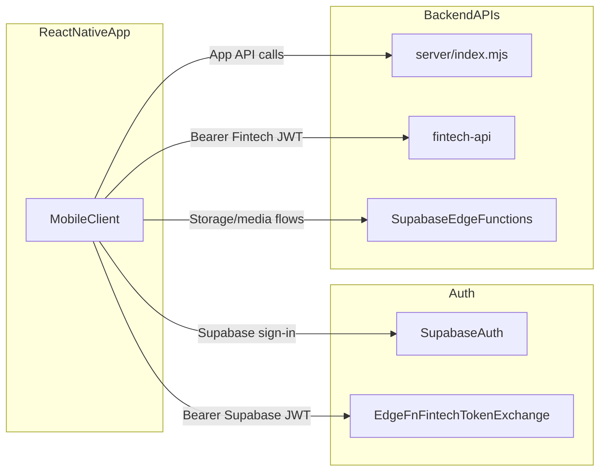

# React Native MVP Spec (Landlord + Tenant)

This spec implements the agreed plan for a new React Native app and maps mobile workflows to existing backend ownership.

## 1) Backend ownership (do not mix)

- `server/index.mjs` (property + voice sidecar): property search, maintenance, viewing schedule, rent payment (Flutterwave flow), support chat, OCR.
- `fintech-api` (ledger API): wallets, escrow, withdrawals, fintech Flutterwave endpoints.
- Supabase: Auth, `notifications` table + realtime subscriptions, storage-backed media/document flows via edge functions.

## 2) Tenant MVP (screens + exact API routes)

### T1. Rent payment + status + receipt

- **Screen:** `TenantPaymentsHome`
  - `GET /api/tenant/payments` (sidecar)
  - `GET /api/payments/insights` (sidecar, optional summary card)
- **Screen:** `PayRentCheckout`
  - `POST /api/payments/rent/flutterwave` (sidecar) -> returns payment link
  - Open payment link in in-app WebView
- **Screen:** `PaymentVerification`
  - Poll `GET /api/payments/status/:tx_ref` (sidecar)
  - Optional receipt download `GET /api/payments/:id/receipt` (sidecar)

### T2. Maintenance request

- **Screen:** `CreateMaintenanceRequest`
  - `POST /api/maintenance` (sidecar)
  - body: `tenant_id`, `property_id`, `issue`
- **Screen:** `MaintenanceStatus` (phase-1 lightweight)
  - Start with read model from tenant dashboard data already returned by existing app APIs/Supabase query.
  - If needed later, add dedicated maintenance listing endpoint in sidecar.

### T3. Property search + viewing scheduling

- **Screen:** `PropertySearch`
  - `GET /api/properties/search` (sidecar)
  - query: `location`, `min_price`, `max_price`, `bedrooms`, `property_type`
- **Screen:** `ScheduleViewing`
  - `POST /api/viewings` (sidecar)
  - body: `property_id`, `user_id`, `date`, `time`

### T4. Support chat / voice

- **Screen:** `SupportChat`
  - `POST /api/support/chat` (sidecar)
  - optional Bearer Supabase JWT for role hint
- **Screen:** `VoiceSupport` (phase 2 of MVP)
  - `POST /api/voice/transcribe/mic` and `POST /api/voice/tts` as needed

### T5. Notifications

- **Screen:** `NotificationsCenter`
  - Primary source: Supabase `notifications` table realtime/listen + read model query.
  - Optional bridge path already exists: `/api/push/webhook` for server-triggered web push workflows.

### T6. Documents (lean)

- **Screen:** `DocumentsUpload`
  - `POST /functions/v1/property-media/init-upload`
  - Upload to storage using signed URL
  - `POST /functions/v1/property-media/complete-upload`
- **Screen:** `DocumentsList`
  - `POST /functions/v1/property-media/list`
- **Screen:** `DocumentOCR` (optional toggle)
  - `POST /api/documents/ocr` (sidecar)

## 3) Landlord MVP (screens + exact API routes)

### L1. Wallet and ledger overview

- **Screen:** `LandlordWallet`
  - `GET /api/wallets/me` (fintech-api, Bearer fintech JWT)
  - `POST /api/wallets/ensure` (fintech-api)

### L2. Escrow management

- **Screen:** `EscrowList`
  - `GET /api/escrow` (fintech-api)
- **Screen:** `EscrowDetail`
  - `GET /api/escrow/:id` (fintech-api)
  - `POST /api/escrow/:id/release` (fintech-api, landlord/admin)
  - `POST /api/escrow/:id/dispute` (fintech-api)

### L3. Withdrawals

- **Screen:** `WithdrawalsList`
  - `GET /api/withdrawals` (fintech-api, landlord/admin)
- **Screen:** `RequestWithdrawal`
  - `POST /api/withdrawals` (fintech-api)
- **Screen:** `WithdrawalDetail`
  - `GET /api/withdrawals/:id`
  - `POST /api/withdrawals/:id/retry`
  - `POST /api/withdrawals/:id/cancel`
  - `POST /api/withdrawals/:id/sync`

### L4. Maintenance oversight

- **Screen:** `LandlordMaintenanceBoard` (phase 1)
  - Start with Supabase read models already powering web dashboards.
  - Add sidecar-specific moderation endpoints only when mobile workflow validates.

### L5. Notifications + documents

- Same pattern as tenant for notifications and `property-media` edge functions.

## 4) Auth contract (locked)

### 4.1 User sign-in

- Mobile uses Supabase Auth (`supabase.auth.signIn...`).
- Mobile stores Supabase access token securely (Keychain/Keystore).

### 4.2 Token exchange for fintech-api

- `POST /functions/v1/fintech-token-exchange`
- Header: `Authorization: Bearer <SUPABASE_ACCESS_TOKEN>`
- Response: `{ fintechToken }`

### 4.3 Calling fintech-api

- Header: `Authorization: Bearer <fintechToken>`
- fintech-api validates:
  - HS256 signature with `JWT_SECRET`
  - `iss` == `JWT_ISSUER`
  - `aud` when configured
  - role claim from `role`/`roles` in: `tenant | landlord | admin`

### 4.4 Role mapping

- Edge function mapping:
  - `owner` or `landlord` -> `landlord`
  - `tenant` -> `tenant`
  - `admin` or `super_admin` -> `admin`

## 5) KPI + instrumentation plan

Track at minimum these events in mobile analytics (Amplitude/Mixpanel/PostHog/Firebase):

- `auth_login_success` / `auth_login_failed`
- `token_exchange_success` / `token_exchange_failed`
- `payment_init_started`
- `payment_webview_opened`
- `payment_verify_success`
- `payment_verify_failed`
- `maintenance_create_submitted`
- `maintenance_create_success`
- `property_search_executed`
- `viewing_schedule_submitted`
- `wallet_view_opened`
- `escrow_release_submitted`
- `withdrawal_create_submitted`
- `notification_opened`
- `document_upload_completed`
- `support_chat_message_sent`

KPI definitions:

- **Payment completion rate:** `payment_verify_success / payment_init_started`
- **Maintenance submission success rate:** `maintenance_create_success / maintenance_create_submitted`
- **Viewing conversion rate:** `viewing_schedule_submitted / property_search_executed`
- **Notification CTR:** `notification_opened / notification_delivered`
- **Withdrawal success rate:** successful withdrawals / submitted withdrawals
- **Critical drop-off:** users with `payment_webview_opened` but no `payment_verify_success` in 24h

## 6) Implementation roadmap (phased)

### Phase 0 - Foundation (week 1)

- Bootstrap React Native app shell (navigation, env config, API clients, secure token storage).
- Integrate Supabase Auth and session persistence.
- Integrate analytics event pipeline.

### Phase 1 - First end-to-end workflow (week 2)

- Implement Tenant Payment flow only (home -> init -> WebView -> verify -> result).
- Add error-state and retry UX.
- Add telemetry for payment funnel.

### Phase 2 - Tenant MVP breadth (weeks 3-4)

- Maintenance create flow.
- Property search + schedule viewing.
- Notifications center.
- Document upload/list (property-media edge function).
- Support chat.

### Phase 3 - Landlord MVP breadth (weeks 5-6)

- Token exchange integration in mobile networking layer.
- Wallet overview.
- Escrow list/detail/release/dispute.
- Withdrawals (create/list/detail/retry/cancel/sync).

### Phase 4 - Hardening + beta (weeks 7-8)

- Role-based QA matrix (tenant/landlord/admin).
- Load and reliability checks on critical endpoints.
- Closed beta cohort + KPI monitoring.
- Production rollout gates based on KPI thresholds.

## 7) Non-goals for this MVP

- Building new payment engines or duplicate webhook processors.
- Rewriting existing backend flows already in sidecar/fintech-api.
- Full offline-first mode (defer until post-MVP validation).
